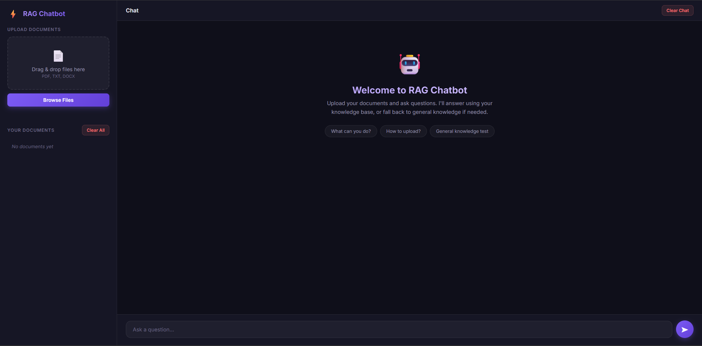

# 🤖 RAG Chatbot

A **Retrieval-Augmented Generation** chatbot that lets you upload your own documents and ask questions. The AI answers using your knowledge base — or falls back to general knowledge when no relevant documents are found.


[](https://rag-chatbot-up84.onrender.com/)
---

## 📺 Demo

<!-- Add your demo GIF or video link here -->
## Demo Video

[](https://drive.google.com/file/d/1nKDd9E_p_SUS78idodrPa26oX1eubYiv/view?usp=sharing)

---

## ✨ Features

- **Multi-format upload** — PDF, DOCX, TXT
- **Semantic chunking** — recursive character splitter with overlap
- **Vector search** — ChromaDB with cosine similarity
- **Hybrid answering** — document context when relevant, general knowledge otherwise
- **Source citations** — see exactly which documents were used
- **Document management** — isolated document deletion and full knowledge base wipe
- **Beautiful dark UI** — glassmorphism design, drag-and-drop upload, clear chat history, responsive

---

## 🏗️ Architecture

```
User Question
     ↓
Embed with Gemini (text-embedding-004)
     ↓
ChromaDB cosine similarity search
     ↓
┌─────────────────────────────────┐
│  Similarity ≥ threshold?        │
│  YES → Build context prompt     │
│  NO  → General knowledge prompt │
└─────────────────────────────────┘
     ↓
Gemini 2.0 Flash generates answer
     ↓
Return answer + source citations
```

---

## 📁 Project Structure

```
RAG_Chatbot/
├── app.py                 # FastAPI server
├── config.py              # Settings & constants
├── document_parser.py     # PDF / DOCX / TXT parser
├── text_chunker.py        # Semantic text splitter
├── vector_store.py        # ChromaDB + Gemini embeddings
├── rag_engine.py          # Retrieval + LLM orchestration
├── requirements.txt       # Python dependencies
├── .env.example           # Environment template
├── static/
│   ├── style.css          # Dark theme styles
│   └── script.js          # Frontend logic
└── templates/
    └── index.html         # Chat UI
```

---

## 🚀 Quick Start

### 1. Clone & enter the project

```bash
cd RAG_Chatbot
```

### 2. Create a virtual environment (recommended)

```bash
python -m venv venv
venv\Scripts\activate        # Windows
# source venv/bin/activate   # macOS / Linux
```

### 3. Install dependencies

```bash
pip install -r requirements.txt
```

### 4. Get a Google Gemini API key

1. Go to [AI Studio](https://aistudio.google.com/apikey)
2. Create an API key (free tier works)
3. Create a `.env` file:

```bash
copy .env.example .env
# Then edit .env and paste your key
```

### 5. Run the server

```bash
uvicorn app:app --reload
```

Open **http://127.0.0.1:8000** in your browser.

---

## 💬 Example Queries

### With uploaded documents

Upload a PDF about machine learning, then ask:

| Query | Expected |
|-------|----------|
| *"What is gradient descent?"* | Answers from your document with source citations |
| *"Summarize the key findings"* | Summary based on document content |

### General knowledge (no documents)

| Query | Expected |
|-------|----------|
| *"What is the capital of France?"* | General knowledge answer, suggests uploading docs |
| *"Explain photosynthesis"* | General knowledge answer |

---

## ⚙️ Configuration

Edit `config.py` to customise:

| Setting | Default | Description |
|---------|---------|-------------|
| `CHUNK_SIZE` | 1000 | Characters per chunk |
| `CHUNK_OVERLAP` | 200 | Overlap between chunks |
| `TOP_K` | 5 | Chunks to retrieve |
| `SIMILARITY_THRESHOLD` | 0.35 | Min similarity to use docs |
| `LLM_MODEL` | gemini-2.0-flash | Gemini model for chat |
| `EMBED_MODEL` | text-embedding-004 | Gemini model for embeddings |

---

## 📝 License

MIT

---
⭐ Star this repo if you found it useful!

Made with ❤️ by Anvesh Pavuluri